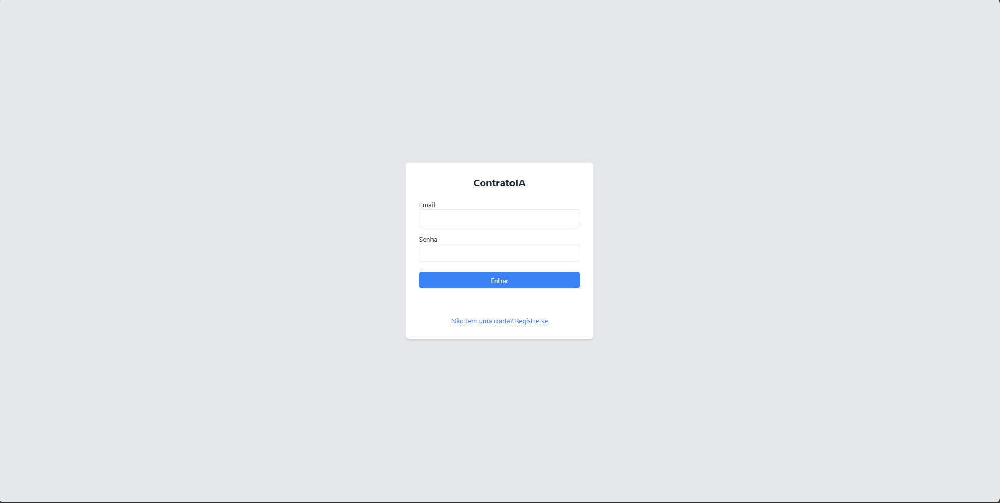
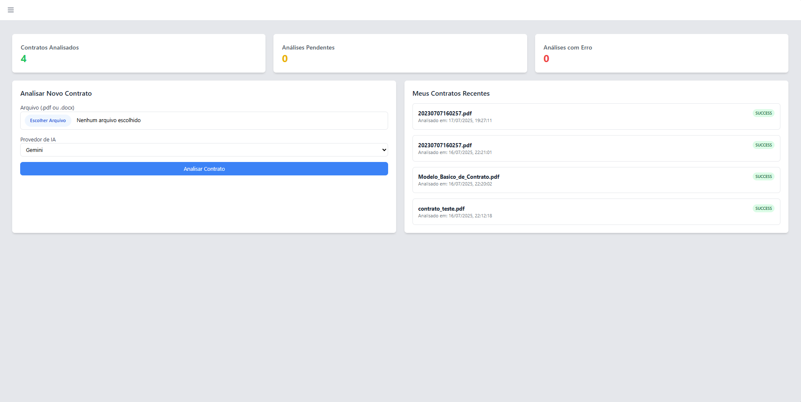

# Projeto: ContratoIA - API de Análise de Contratos com IA

## 1. Descrição do Projeto

**ContratoIA** é uma aplicação web completa projetada para simplificar a análise e gestão de contratos. A plataforma permite que usuários autenticados façam o upload de documentos de contrato (nos formatos `.pdf` e `.docx`), que são então analisados por um serviço de Inteligência Artificial (Google Gemini) para extrair informações cruciais de forma estruturada.

A aplicação conta com uma API RESTful robusta e uma interface de usuário simples e reativa, permitindo o upload, a consulta e a visualização dos dados extraídos. O sistema também possui um painel administrativo para gerenciamento de usuários e contratos.

## 2. Visão Geral da Arquitetura

O projeto é construído sobre uma arquitetura moderna e conteinerizada, garantindo escalabilidade, manutenibilidade e um ambiente de desenvolvimento isolado e reprodutível.

-   **Backend:** **FastAPI**, um framework Python moderno e de alta performance para construir APIs.
-   **Banco de Dados:** **PostgreSQL**, para persistir os dados de usuários, contratos e logs de auditoria.
-   **Cache:** **Redis**, utilizado para armazenar em cache os detalhes de contratos, melhorando a velocidade de resposta para consultas frequentes.
-   **Análise de IA:** Integração com a API do **Google Gemini** para extração de dados estruturados dos textos dos contratos.
-   **Frontend:** Interface web construída com **Jinja2** para renderização de templates no lado do servidor, **TailwindCSS** para estilização e **Alpine.js/Vanilla JavaScript** para interatividade.
-   **Autenticação:** Sistema de autenticação seguro baseado em **JSON Web Tokens (JWT)**, com proteção de rotas de API (Bearer Token) e de páginas web (HttpOnly Cookie).
-   **Permissões:** Sistema de papéis (Role-Based Access Control) diferenciando usuários `ADMIN` e `USER`.
-   **Auditoria:** Registro de ações importantes (criação de usuário, exclusão de contrato, etc.) em uma tabela de logs.
-   **Contêineres:** **Docker** e **Docker Compose** orquestram todos os serviços (`app`, `db`, `cache`), permitindo que toda a aplicação seja iniciada com um único comando.

## 3. Telas da Aplicação

#### Tela de Login


#### Dashboard Principal


#### Visualização de Contrato


## 4. Instruções de Instalação e Execução

Siga os passos abaixo para configurar e rodar o ambiente de desenvolvimento.

**1. Instale o Docker e Docker Compose**

O Docker é essencial para rodar este projeto. O Docker Compose orquestra os múltiplos contêineres da nossa aplicação.

* **Para Windows e macOS:**
    A maneira mais fácil é instalar o **Docker Desktop**, que já inclui o Docker Compose. Baixe-o no site oficial:
    [https://www.docker.com/products/docker-desktop/](https://www.docker.com/products/docker-desktop/)

* **Para Linux:**
    Siga o guia de instalação oficial para a sua distribuição Linux. O Docker Compose já vem como um plugin na maioria das instalações modernas (`docker compose`).
    Acesse as instruções em: [https://docs.docker.com/engine/install/](https://docs.docker.com/engine/install/)

**2. Clone o Repositório**
```bash
git clone [https://github.com/DeaconKrauser/projeto-entrevista.git](https://github.com/DeaconKrauser/projeto-entrevista.git)
cd projeto-entrevista
```

**3. Crie o Arquivo de Variáveis de Ambiente**
Copie o arquivo de exemplo `.env.example` para criar seu próprio arquivo `.env`.

```bash
cp .env.example .env
```

**4. Configure suas Variáveis**
Abra o arquivo `.env` com seu editor de texto e preencha as variáveis de ambiente necessárias, especialmente as credenciais do banco de dados e as chaves de API para os serviços de IA.

**5. Suba a Aplicação**
Com o Docker em execução, utilize o Docker Compose para construir as imagens e iniciar todos os contêineres.

```bash
docker compose up --build
```
Para rodar em segundo plano (detached mode), use a flag `-d`:
```bash
docker compose up --build -d
```

**6. Crie o Primeiro Usuário Administrador**
O primeiro usuário deve ser criado via linha de comando para garantir que ele tenha o papel de `ADMIN`. Execute o comando abaixo, substituindo pelo email e senha desejados:

```bash
docker compose exec app python create_admin.py admin@exemplo.com senha_forte_123
```

**7. Acesse a Aplicação**
Após a conclusão dos comandos, a aplicação estará disponível em: **[http://localhost:8000](http://localhost:8000)**. Você pode se logar com o admin criado ou registrar novos usuários (que terão o papel `USER` por padrão).

## 5. Exemplos de Uso da API (cURL)

Você pode interagir com a API diretamente via linha de comando.

#### Registrar um Novo Usuário (público)
```bash
curl -X 'POST' \
  'http://localhost:8000/api/register' \
  -H 'Content-Type: application/json' \
  -d '{
        "email": "usuario.comum@exemplo.com",
        "password": "outra_senha_123",
        "first_name": "Usuario",
        "last_name": "Comum"
      }'
```

#### Fazer Login e Obter o Token
```bash
curl -X 'POST' \
  'http://localhost:8000/api/login' \
  -H 'Content-Type: application/x-www-form-urlencoded' \
  -d 'username=admin@exemplo.com&password=senha_forte_123'
```
*Este comando retornará um `access_token`. Exporte-o para uma variável de ambiente para usar nos próximos requests.*
```bash
export TOKEN="COLE_SEU_TOKEN_DE_ACESSO_AQUI"
```

#### Fazer Upload de um Contrato (autenticado)
```bash
curl -X 'POST' \
  'http://localhost:8000/api/contracts/upload' \
  -H "Authorization: Bearer $TOKEN" \
  -F 'file=@/caminho/para/seu/contrato_teste.pdf' \
  -F 'ai_provider=gemini'
```

#### Listar Todos os Contratos (como Admin)
```bash
curl -X 'GET' \
  'http://localhost:8000/api/contracts/' \
  -H "Authorization: Bearer $TOKEN"
```

#### Excluir um Contrato (como Admin ou Dono)
*Substitua `{id_do_contrato}` pelo ID do contrato que deseja excluir.*
```bash
curl -X 'DELETE' \
  'http://localhost:8000/api/contracts/{id_do_contrato}' \
  -H "Authorization: Bearer $TOKEN"
```